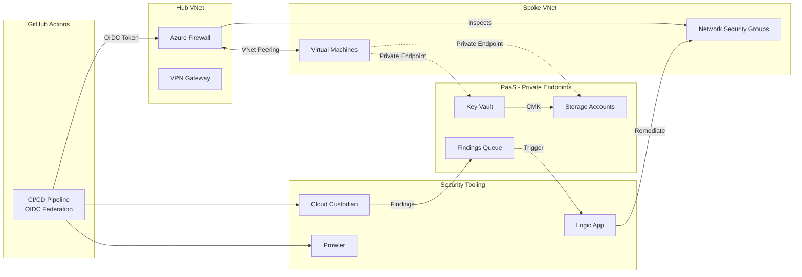

# Azure-Cloud-Security-Platform

An end-to-end, production-grade Azure security platform built entirely in Terraform. Implements a hub-spoke secure landing zone with Azure Firewall, zero-trust identity via OIDC and Managed Identities, PaaS private networking with Private Endpoints, data encryption with Customer Managed Keys, cloud security posture management via Cloud Custodian and native Azure Policy, IaC security scanning in CI, and automated remediation via Logic Apps.

